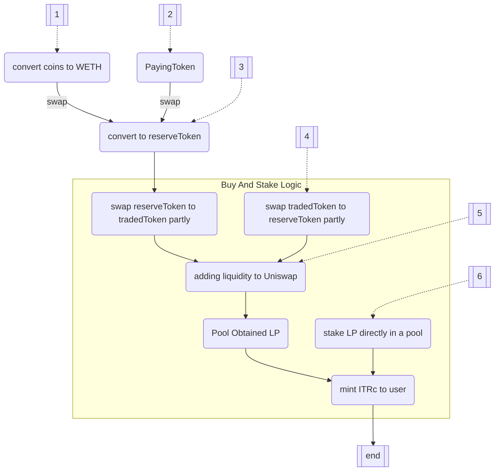

# StakingContract
StakingContract is not a single contract but it is a complex mechanism of several contracts that linked between itselfs. \
StakingContract allows to distributed tokens(`tradedToken`) by staking it for a period. 
Here and below we will call it **ITR**, like **I**nves**T**o**R** token.\
So user should:
- buy it for another erc20 token `reserveToken` like USDT, USDC or native coin ETH. 
- stake it for a period(depends of pool) and obtain `community coins`(we call it **ITRc** like **I**nves**T**o**R** **c**ommunity token.)
- unstake `community coins` after period passed to get `tradedToken` and `reserveToken` tokens with some fraction bonuses 
> Actually bonus will applied for ITRc. so user obtain additionally bonus ITRc and can unstake it, only paid for smth. but about this it will write below

StakingContract represented with two pools `CommunityStakingPool` and `CommunityStakingPoolERC20`, that can not be used simultaneously in one `ComminityCoin` scope 
The list of basic features:
- buy and stake `tradedToken` in the various ways describe below(see How to stake)
- unstake staked tokens after locked up period passed
- redeem `tradedToken` tokens in any time if have redeem role
- as owner of contract can applied bonuses, taxes and make ecosystem more flexible
- make manage most functions that happens on contract and revert it if necessary

# Contracts
As said before StakingContract is a several contracts:
- `CommunityCoinFactory.sol` is a factory contract that can produce `CommunityCoin` by clone it from implementation
- `CommunityCoin.sol` is a template contract and ERC777 token `ITRc`. contract can produce staking pool.
- `CommunityStakingPool.sol` is a contract that represented pool. Pools are holders of LP tokens(Liquidity Pools)
- `CommunityStakingPoolERC20.sol` is a contract that represented pool too, but as opposed to staking pool there are no Uniswap interactions. Here just using ERC20 token to use as traded and reserved
- `Rewards.sol` - optional contract that implements `IHook` interface. Used for grant additional bonus of any token as the user more and more unstake ITRc.
- `Taxes` - optional contract  that implements `ITaxes` interface. Used to correct amount of transfer ITRc tokens.

# Interactions
Here we will describe main user cases like: stake, unstake, redeem, remove liquidity, etc.
## Preparing to correct work
if using usual `CommunityStakingPool` then:
- make sure that in uniswap(pancakeSwap, etc) have exists necessary pairs, like [tradedToken]:[reserveToken], 
[reserveToken]:[WETH],
[reserveToken]:[payingToken]

## Steps to deploy
StakingContract is a complex of several contracts that linked between itselfs. We developed pattern that any produced instances use the same code deployed before and interact with it through DELEGATE_CALL. So any instance should be produced only by factory.\
So deployed process contains from two steps:
 1. Deploy implementations\
`communityCoin.sol`\
`communityStakingPoolFactory.sol`\
`communityStakingPool.sol`\
`communityStakingPoolErc20.sol`\
`poolStakesLib.sol`\
All contracts have proxy-based upgradeability system. so no constructors can be used in upgradeable contracts.\
example in `./scripts/deploy-implementations.js` 
 2. Deploy factory
deployed `CommunityCoinFactory.sol` with addresses of implementations deployed in the step before and `Costmanager` address that can be empty \
example in `./scripts/deploy.js` 

## Steps to use
1. Need to create CommunityCoin
To produce `CommunityCoin` instance user should call produce with params:

|name|type|description|
|-|-|-|
|reserveToken|address|address of reserve token. like a WETH, USDT,USDC, etc.|
|tradedToken|address|address of traded token. usual it intercoin investor token|
|hook|address|address of contract implemented IHook interface and used to calculation bonus tokens amount|
|discountSensitivity|uint256|value that manage amount tokens in redeem process. multiplied by `FRACTION`(10**5 by default)|
|communitySettings|tuple|tuple of community settings. see below|

struct CommunitySettings

|name|type|description|
|-|-|-|
|invitedByFraction|uint256|fraction(multiplied by `FRACTION`) that will get inviter when invited person do unstake operation |
|addr|address|address of community contract|
|redeemRoleId|uint8|users with this role can be able to redeem or redeem and remove liquidity|
|circulationRoleId|uint8|users with this role can call `addToCirculation`|
|tariffRoleId|uint8|users with this role can set tariffcall `setComission`|

## How to stake
There are several ways:

1. `buyAndStakeLiquidity` (via ETH)
User send network coins(ETH,BNB,MATIC,etc) directly(or with payable method) into the `CommunityStakingPool`. 
Contract do following:
	- swap coins  will converts into WrappedCoins(WETH).  
	- swap WETH into `reserveToken`. 
	- then using Formula#1 converts part of reserve tokens to traded to make sure that adding to liquidity happens without remainder.
	> if uniswap pair [reserveToken]:[WETH] does not exists then transactions will revert.
	
2. `buyAndStakeLiquidity` (via paying token)
User make `ERC20::approve`  paying tokens into `CommunityStakingPool` contract and call `buyAndStakeLiquidity`.  
Contract do following:
	- swap paying tokens into `reserveToken`. 
	- then using Formula#1 converts part of reserve tokens to traded to make sure that adding to liquidity happens without remainder.
	> if uniswap pair [reserveToken]:[payingToken] does not exists then transactions will revert.
	
3. `buyAndStakeLiquidity` (via reserve token)
User make `ERC20::approve` reserve tokens into `CommunityStakingPool` contract and call `buyAndStakeLiquidity`.  
Contract do following:
	- using Formula#1 converts part of reserve tokens to traded to make sure that adding to liquidity happens without remainder.

4. `sellAndStakeLiquidity`
used in cases when user already have `tradedToken` but didn't get enough reserved tokens. So user make `ERC20::approve` traded tokens into `CommunityStakingPool` contract and call `sellAndStakeLiquidity`.  

5. `stakeLiquidity` 
used in cases when user have already LP tokens. Could be obtained after unstake/redeem or transfered by another user. So user make the same as before: make `ERC20::approve` LP tokens into `CommunityStakingPool` contract and call `sellAndStakeLiquidity`.  

6. `addAndStakeLiquidity`
used in cases when user have traded and reserve tokens. So user make the same as before: make `ERC20::approve` both tokens into `CommunityStakingPool` contract and call `addAndStakeLiquidity`.  Keep in mind that there are no calculation to add liquidity without remainder. If one of tokens fully consuming but other not, then all that left will refund to user back.

## How to unstake
[in progress]

## How to redeem
[in progress]

## CommunityContract
using external Community Contract as a contraсt that checking users rights
[in progress]

## Bonuses
General information about bonuses. how, where, when.
[in progress]

## Taxes

## Formulas 
#### **Formula#1**. 

> How much tokens need to swap from one reserve to get another and fully
> added to liquidity without remainder

Where: 
r1 - reserve at uniswap(reserve side 1) 
r2 - incoming amount of reserve(side 1) token 
r3 - tokens amount from reserve side1 that need to use `swapExactTokensForTokens` 

